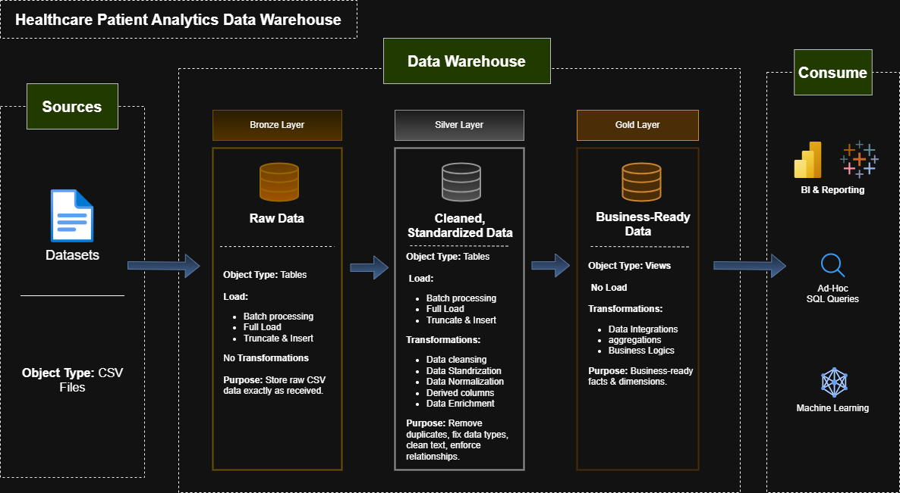

# 🏥 Patient Data Modeling & ETL Insights
A Complete Data Warehouse and Analytics Project

Welcome to the **Patient Data Modeling & ETL Insights** repository! 🚀
This project demonstrates a full end-to-end Data Warehouse and Analytics pipeline built using industry-standard data engineering practices. It covers everything from data modeling, ETL pipeline development, and data quality checks, to building a multi-layer data warehouse (Bronze → Silver → Gold) and generating meaningful healthcare insights.

---
## 🎯 Project Overview

This project simulates a real-world Hospital Patient Analytics System, where raw patient, doctor, visit, and diagnosis data flows through multiple transformation stages before becoming clean, standardized, and analysis-ready.

The workflow follows the Medallion Architecture:


1. **Bronze Layer**: Stores raw data as-is from the source systems. Data is ingested from CSV Files into SQL Server Database.
2. **Silver Layer**: This layer includes data cleansing, standardization, and normalization processes to prepare data for analysis.
3. **Gold Layer**: Houses business-ready data modeled into a star schema required for reporting and analytics.

---

## 📖 Project Overview

This project involves:

1. **Data Architecture**: Designing a Modern Data Warehouse Using Medallion Architecture **Bronze**, **Silver**, and **Gold** layers.
2. **ETL Pipelines**: Extracting, transforming, and loading data from source systems into the warehouse.
3. **Data Modeling**: Developing fact and dimension tables optimized for analytical queries.

🎯 This repository is an excellent resource for showcaseing expertise in:
- SQL Development
- Data Architect
- Data Engineering  
- ETL Pipeline  
- Data Modeling  
- Data Analytics  

---

## 🚀 Project Requirements

#### Objective
Develop a modern data warehouse using SQL Server to consolidate sales data, enabling analytical reporting and informed decision-making.

#### Specifications
- **Data Sources**: Import data from provided CSV files in data repostraty or download and view from this Link: https://claude.ai/public/artifacts/d84285b4-d519-4af2-a764-c45a27fd453b
- **Data Quality**: Cleanse and resolve data quality issues prior to analysis.
- **Integration**: Combine sources into a single, user-friendly data model designed for analytical queries.
- **Scope**: Focus on the latest dataset only; historization of data is not required.

## 🏗️ Tech Stack Used

- Python (Pandas, SQLAlchemy) for ETL
- MySQL for Data Warehouse
- claude for creating messy data
- Download Data From Here: https://claude.ai/public/artifacts/d84285b4-d519-4af2-a764-c45a27fd453b


## 📂 Repository Structure
```
Healthcare-Data-Warehouse/
│
├── data/                             # Raw CSV input files
│   ├── patients.csv
│   ├── doctors.csv
│   ├── visits.csv
│   └── diagnosis.csv
│
│
├── docs/                             # Architecture diagrams
│   ├── data_architecture.png
│   ├── data_catlog.md
│   └──  naming_conventions.md
│   
│
├── Python/                           # Python ETL scripts
│   ├── etl_load_bronze.py
│   └── etl_transform_to_silver.py
│
│
├── sql/                              # SQL scripts for DW layers
│   ├── bronze.sql
│   ├── silver.sql
│   └── gold.sql
│   
│
├── .gitignore                        # Project overview and instructions
├──  LICENSE                          # License information for the repository 
└─── README.md                        # Files and directories to be ignored by Git

```

## 🛡️ License

This project is licensed under the [MIT License](LICENSE). You are free to use, modify, and share this project with proper attribution.


---

## 🌟 About the Author

**Uday Sathwara** — B.Tech Computer Engineering student. Passionate about data engineering, building ETL pipelines, and creating analytics solutions.
